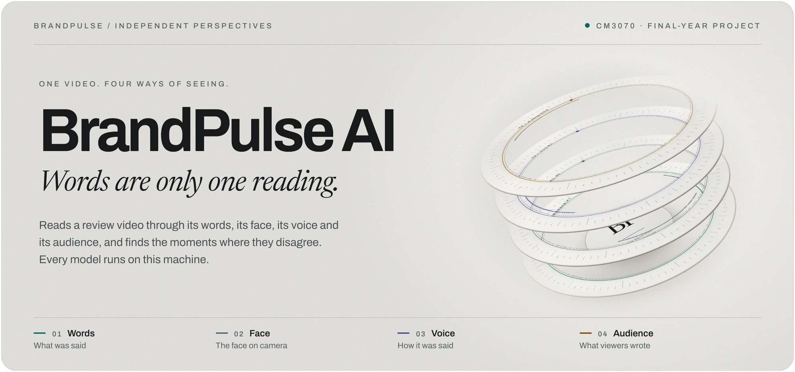
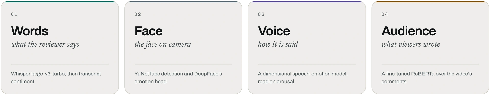
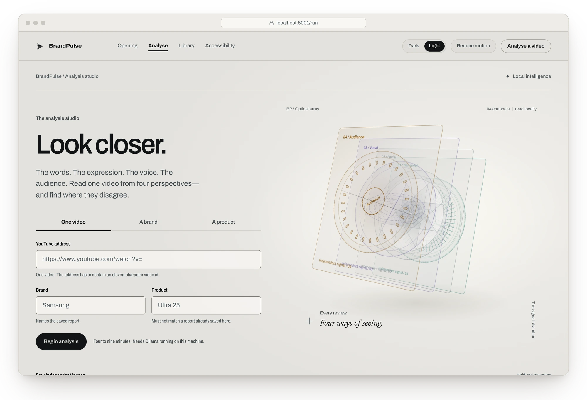
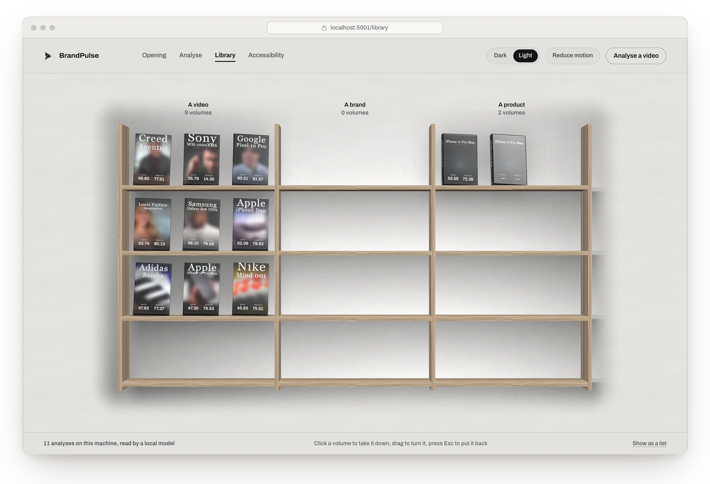
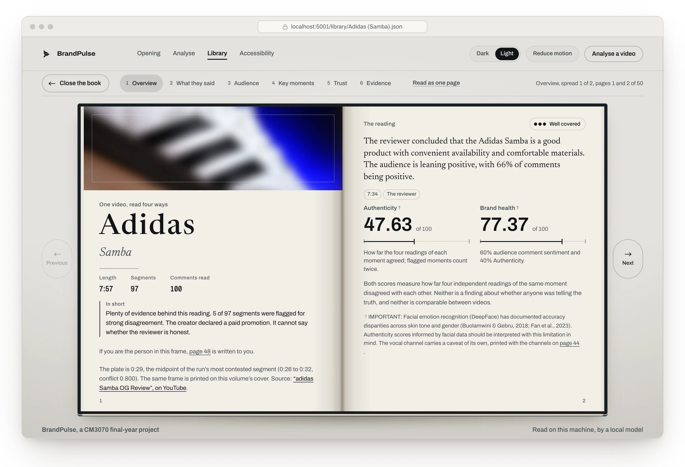
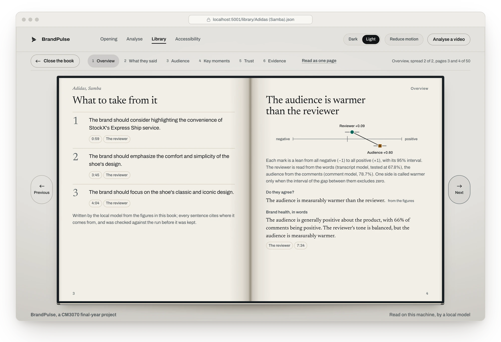
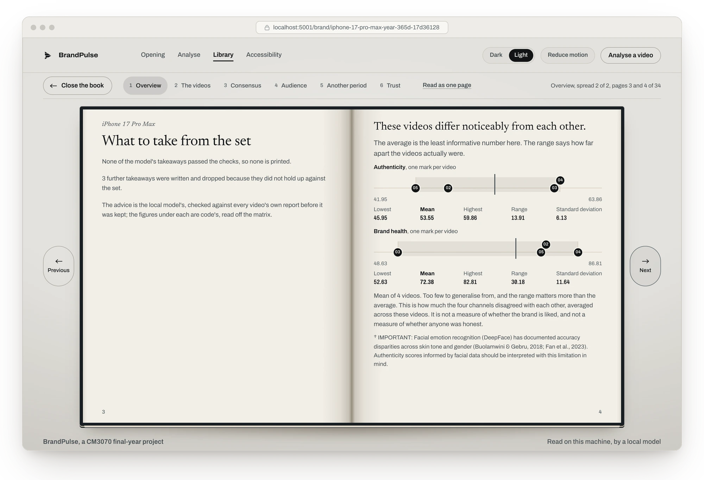
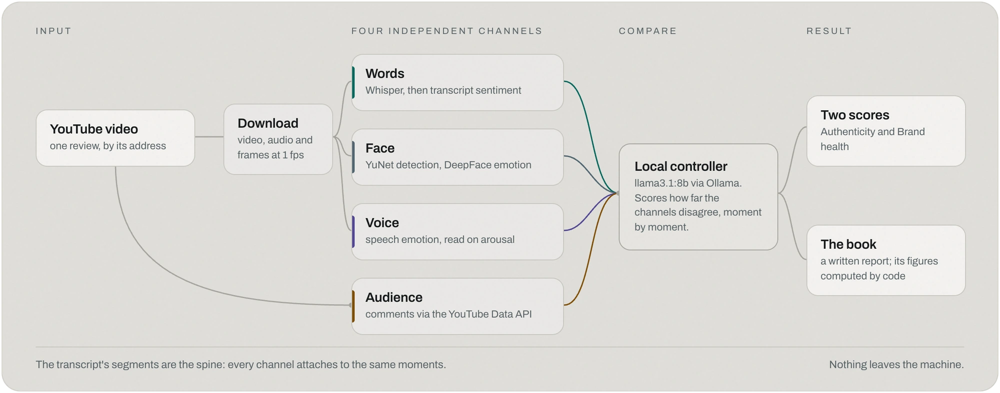
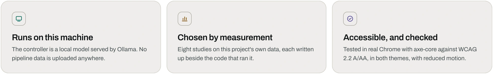

<div align="center">

<picture>
  <source media="(prefers-color-scheme: dark)" srcset="docs/images/banner-dark.webp">
  
</picture>

<br>

<p><sub>
04 INDEPENDENT CHANNELS &nbsp;&nbsp;·&nbsp;&nbsp; 08 MEASURED STUDIES &nbsp;&nbsp;·&nbsp;&nbsp;
01 LOCAL CONTROLLER &nbsp;&nbsp;·&nbsp;&nbsp; LOCAL MODEL INFERENCE
</sub></p>

<p>
<a href="#the-premise"><b>Premise</b></a> &nbsp;·&nbsp;
<a href="#the-experience"><b>Experience</b></a> &nbsp;·&nbsp;
<a href="#the-method"><b>Method</b></a> &nbsp;·&nbsp;
<a href="#quick-start"><b>Run locally</b></a> &nbsp;·&nbsp;
<a href="research/README.md"><b>Research</b></a> &nbsp;·&nbsp;
<a href="evaluation/README.md"><b>Evaluation</b></a> &nbsp;·&nbsp;
<a href="#reference"><b>Reference</b></a>
</p>

</div>

<br>

## The premise

### One video can tell four different stories.

BrandPulse reads a YouTube review through what was said, the face on camera, the voice carrying
the words and the audience responding underneath. The four channels never see one another's
output. A local controller compares them moment by moment and finds where the readings separate.

<picture>
  <source media="(prefers-color-scheme: dark)" srcset="docs/images/channels-dark.webp">
  
</picture>

<p align="center"><i>One subject. Four independent readings. The disagreement becomes the result.</i></p>

> [!IMPORTANT]
> **The limits stay visible.** The facial channel scores below an always-NEUTRAL constant on unseen
> speakers, the vocal channel is weak, and the controller choice can move the Authenticity score by
> tens of points on identical inputs. BrandPulse places those limits beside the numbers they qualify.

<br>

## The experience

### The analysis does not end in a dashboard. It becomes an object.

The interface carries the same piece of work from input to shelf, from shelf to volume, and from
volume to evidence. Light, dark and reduced-motion modes are part of that same system.

<table>
  <tr>
    <td width="50%" valign="top">
      <picture>
        <source media="(prefers-color-scheme: dark)" srcset="docs/images/run-dark.webp">
        
      </picture>
      <p><b>01 / Begin.</b><br><sub>Analyse one video, or assemble five around a brand or product.</sub></p>
    </td>
    <td width="50%" valign="top">
      <picture>
        <source media="(prefers-color-scheme: dark)" srcset="docs/images/library-dark.webp">
        
      </picture>
      <p><b>02 / Keep.</b><br><sub>The finished analysis takes its place in the Library as a volume.</sub></p>
    </td>
  </tr>
</table>

<picture>
  <source media="(prefers-color-scheme: dark)" srcset="docs/images/book-turn-dark.webp">
  
</picture>

<p align="center"><sub><b>03 / Open.</b> The selected volume becomes the report—overview, words, audience, key moments, trust and evidence.</sub></p>

<table>
  <tr>
    <td width="50%" valign="top">
      <picture>
        <source media="(prefers-color-scheme: dark)" srcset="docs/images/report-dark.webp">
        
      </picture>
      <p><b>04 / Read.</b><br><sub>Each conclusion sits beside its figures and cites the moment it came from.</sub></p>
    </td>
    <td width="50%" valign="top">
      <picture>
        <source media="(prefers-color-scheme: dark)" srcset="docs/images/set-dark.webp">
        
      </picture>
      <p><b>05 / Compare.</b><br><sub>Five independent reviews become one view of a brand or product.</sub></p>
    </td>
  </tr>
</table>

<br>

## The method

### Four readings enter separately. They meet only at comparison.

<picture>
  <source media="(prefers-color-scheme: dark)" srcset="docs/images/diagram-dark.webp">
  
</picture>

The transcript supplies the shared timeline. Every channel attaches to the same moments; the
controller scores their disagreement; deterministic code produces the headline figures. The local
model writes the report last, and every sentence is checked against the completed run before it is
kept.

<picture>
  <source media="(prefers-color-scheme: dark)" srcset="docs/images/highlights-dark.webp">
  
</picture>

<br>

## The evidence

The model choices were measured against alternatives on this project's own data. The research
record keeps the protocols, cached results, limitations and claim checkers beside the code that
produced them.

| | Read | What it establishes |
|---|---|---|
| **Research** | [`research/README.md`](research/README.md) | eight model studies, their decisions and reproducible checks |
| **Evaluation** | [`evaluation/README.md`](evaluation/README.md) | pilot and user studies, report-quality evaluation and interface evidence |
| **Findings** | [`docs/PROTOTYPE_FINDINGS.md`](docs/PROTOTYPE_FINDINGS.md) | what worked, what failed and what the prototype can support |
| **Inclusive design** | [`docs/INCLUSIVE_DESIGN.md`](docs/INCLUSIVE_DESIGN.md) | the accessibility and inclusion record behind the interface |

<br>

## Quick start

### One command prepares the project.

Clone the repository, run the setup script for the operating system, then start the server. The
installer checks the machine before changing anything and keeps an existing virtual environment or
private `.env` file when it is already valid.

> [!TIP]
> **Saved-report mode.** The reports and five-video sets committed in `outputs/` can be opened
> without an API key, ffmpeg, Ollama or a model download. Use the lightweight setup command shown
> below when only the supplied results need to be viewed.

| Component | Open the saved reports | Run a new analysis |
|---|:---:|:---:|
| Python 3.11 and Python packages | installed by setup | installed by setup |
| ffmpeg | skipped | installed by setup |
| Ollama and `llama3.1:8b` | skipped | installed by setup |
| YouTube Data API v3 key | not required | added privately after setup |

Node.js is needed only to rebuild the interface. Current Ollama releases need macOS 14 or newer,
or Windows 10 version 22H2 or newer.

**1 &nbsp;Get the code**

```console
git clone https://github.com/naveenlabs/brandpulse-ai.git
cd brandpulse-ai
```

Downloading the repository as a ZIP also works. On Windows, keep the folder path short, such as
`C:\brandpulse-ai`; deeply nested paths can exceed Windows' path limit while machine-learning
packages are being installed.

**2 &nbsp;Prepare the project**

The full setup installs missing system tools through the platform's standard package manager,
creates `.venv`, installs `requirements.txt`, starts Ollama, downloads the 4.9 GB controller model,
and creates `.env` from the safe example. It never replaces an existing `.env` file.

<details open>
<summary><b>macOS or Linux</b></summary>

```bash
bash setup.sh
```

</details>

<details>
<summary><b>Windows 10/11 · PowerShell</b></summary>

```powershell
powershell -ExecutionPolicy Bypass -File .\setup.ps1
```

Windows Package Manager (`winget`) is included with current Windows 10 and 11 installations. If it
is missing, install **App Installer** from Microsoft Store and repeat the command.

</details>

The installer may request the computer's administrator password while adding system software. The
first full setup also downloads several gigabytes of Python and model files, so it can take time.
Every completed stage is printed clearly; if a stage cannot finish, the script stops with the exact
next action instead of continuing with a partial installation.

<details>
<summary><b>Open only the supplied reports</b> · smaller setup</summary>

```bash
bash setup.sh --saved-reports-only       # macOS / Linux
```

```powershell
powershell -ExecutionPolicy Bypass -File .\setup.ps1 -SavedReportsOnly
```

</details>

<details>
<summary><b>Manual setup</b> · use only if automatic installation is restricted</summary>

<br>

**macOS**

```bash
brew install python@3.11 ffmpeg ollama
brew services start ollama
python3.11 -m venv .venv
.venv/bin/python -m pip install --upgrade pip setuptools wheel
.venv/bin/python -m pip install -r requirements.txt
ollama pull llama3.1:8b
cp .env.example .env
```

If Homebrew is not installed, use its official installer from [brew.sh](https://brew.sh/). A
python.org installation of Python 3.11 also works; run **Install Certificates.command** from
`/Applications/Python 3.11/` after installing it.

**Windows · PowerShell**

```powershell
winget install --id Python.Python.3.11 -e
winget install --id Gyan.FFmpeg -e
winget install --id Ollama.Ollama -e
py -3.11 -m venv .venv
.\.venv\Scripts\python.exe -m pip install --upgrade pip setuptools wheel
.\.venv\Scripts\python.exe -m pip install -r requirements.txt
ollama pull llama3.1:8b
Copy-Item .env.example .env
```

Reopen PowerShell after the three `winget` commands if a newly installed command is not found.

**Linux**

Install Python 3.11, its `venv` package, ffmpeg and curl with the distribution's package manager,
then install Ollama with its official script:

```bash
curl -fsSL https://ollama.com/install.sh | sh
python3.11 -m venv .venv
.venv/bin/python -m pip install --upgrade pip setuptools wheel
.venv/bin/python -m pip install -r requirements.txt
ollama pull llama3.1:8b
cp .env.example .env
```

</details>

**3 &nbsp;Add the YouTube API key** &nbsp;<sub>(only for new analyses)</sub>

<details open>
<summary><b>Create a key in Google Cloud</b></summary>

1. Sign in to the [Google Cloud console](https://console.cloud.google.com/) with a Google account.
2. [Create a project](https://console.cloud.google.com/projectcreate), or select an existing project
   from the project menu at the top of the console.
3. Open the [YouTube Data API v3 library page](https://console.cloud.google.com/apis/library/youtube.googleapis.com),
   confirm the correct project is selected, and choose **Enable**.
4. Open [APIs & Services → Credentials](https://console.cloud.google.com/apis/credentials) and
   choose **Create credentials → API key**.
5. Restrict the key to **YouTube Data API v3**. If the restriction options appear on the creation
   screen, choose **API restrictions → Restrict key → YouTube Data API v3**, then create the key.
   If Google displays the key immediately, copy it first, choose **Edit API key**, apply the same
   restriction and save. Google may take a few minutes to apply a new restriction.
6. Copy the generated key without sharing it or adding it to the repository.

The application needs a standard API key only; OAuth client credentials are not required. Keep the
key private, never paste it into source code, and never commit the `.env` file. Google's
[YouTube Data API overview](https://developers.google.com/youtube/v3/getting-started) and
[API-key security guidance](https://cloud.google.com/docs/authentication/api-keys-best-practices)
cover the same setup and security rules in full.

</details>

Open `.env` in the project root. Its first setting reads:

```dotenv
YOUTUBE_API_KEY=your_youtube_data_api_v3_key_here
```

Replace the text after `=` with the copied key, without quotes or spaces, and save the file. The
key is used to retrieve public video details, comments and search results; it is never shown in the
interface or written into a saved report. Restart the server after changing it.

**4 &nbsp;Run**

<details open>
<summary><b>macOS or Linux</b></summary>

```bash
.venv/bin/python -m flask --app app run --port 5001
```

</details>

<details>
<summary><b>Windows · PowerShell</b></summary>

```powershell
.\.venv\Scripts\python.exe -m flask --app app run --port 5001
```

</details>

Open **http://localhost:5001**. The first analysis downloads about 3 GB of channel models in
addition to the Ollama model. For the fine-tuned comment model, see "Models" below; without it the
pipeline still runs on the weaker public checkpoint.

<details>
<summary><b>Setup troubleshooting</b></summary>

<br>

| Message | Meaning and fix |
|---|---|
| `Windows Package Manager (winget) is required` | Install **App Installer** from Microsoft Store, reopen PowerShell and rerun `setup.ps1`. |
| Homebrew asks for **Next steps** | Run the commands Homebrew printed, reopen Terminal and rerun `bash setup.sh`. |
| `.venv uses a different Python version` | Remove only the `.venv` folder and rerun the setup script; saved reports and project files are unaffected. |
| `ffmpeg` or `ollama` is not available | Reopen the terminal so its `PATH` includes the new program, then rerun setup. Completed stages are reused. |
| `Ollama did not start` | Run `ollama serve` in a second terminal, leave it open and rerun setup. |
| `Windows Long Path support` in a pip error | Move the project to a short path such as `C:\brandpulse-ai`, then rerun setup. |
| `CERTIFICATE_VERIFY_FAILED` on macOS | Run **Install Certificates.command** in `/Applications/Python 3.11/`, then rerun setup. |
| `YOUTUBE_API_KEY environment variable is not set` | Complete step 3 and confirm that `.env` is beside `app.py`. |

</details>

<p align="center"><sub>ONE-COMMAND SETUP &nbsp;·&nbsp; PYTHON 3.11 &nbsp;·&nbsp; FFMPEG &nbsp;·&nbsp; OLLAMA &nbsp;·&nbsp; LOCAL INFERENCE</sub></p>

| Page | |
|---|---|
| `/` | what the system is and how it reads a video |
| `/run` | analyse one video (4 to 9 minutes) or find and analyse five about a subject |
| `/library` | saved reports and five-video sets |
| `/library/<file>`, `/brand/<set>` | a report, and a combined report, read as a book |
| `/accessibility` | the accessibility statement |

<br>

## Reference

```
setup.sh  setup.ps1                   one-command setup for macOS, Linux and Windows
app.py  main.py  write_analysis.py    the server and the two command-line tools
pipeline/                             the analysis pipeline, five-video sets, report imagery
interface/                            the web interface: source, built site, build tools
research/                             how every model was chosen, one study per folder
evaluation/                           user studies, the written report's quality, interface checks
docs/                                 findings, the inclusive-design record, README images
outputs/                              saved reports, their written reports, five-video sets
models/                               the fine-tuned comment model's installer (weights not in git)
tests/                                the test suite
```

| Read next | |
|---|---|
| [`research/README.md`](research/README.md) | the eight model studies: what each tested, what it chose, how to check its numbers |
| [`evaluation/README.md`](evaluation/README.md) | the user studies, the written report's evaluation, the interface checks, what stays private |
| [`interface/README.md`](interface/README.md) | how the interface is built: fonts, grain, frames and the Vite build |
| [`models/README.md`](models/README.md) | installing the fine-tuned comment model |
| [`docs/PROTOTYPE_FINDINGS.md`](docs/PROTOTYPE_FINDINGS.md) | what the prototype found |
| [`docs/INCLUSIVE_DESIGN.md`](docs/INCLUSIVE_DESIGN.md) | the inclusive-design record |

The commands in the sections below run `python` from the environment created in step 2. Activate it
once in each new terminal, from the project folder:

```bash
source .venv/bin/activate          # macOS / Linux
```

```powershell
.\.venv\Scripts\Activate.ps1       # Windows / PowerShell
```

If PowerShell answers `running scripts is disabled on this system`, run
`Set-ExecutionPolicy -Scope Process -ExecutionPolicy Bypass` first; it applies to that window only.

<details>
<summary><b>What is where</b>, folder by folder</summary>

<br>

**The application**

| Path | What it is |
|---|---|
| `app.py` | Flask server: the pages, the JSON API, analysis jobs (each in its own process), five-video "sweeps" |
| `main.py` | Command-line run of the pipeline on one video |
| `write_analysis.py` | Writes or re-checks the written report for saved runs |
| `pipeline/` | The pipeline: `downloader`, `audio_module` (Whisper, transcript sentiment, vocal emotion, prosody), `visual_module` (faces), `comment_module`, `youtube_api` (API errors without the key), `orchestrator` (the local controller), `scorer`, and `analyst*` (the written report) |
| `pipeline/sweep.py` | Finding, analysing and combining five videos about one subject |
| `pipeline/frame_cache.py` | Derives the report pages' imagery from the analysed frames |
| `interface/ui/` | The interface source (Vite): `src/pages/` one module per page, `src/lib/` shared modules, `src/styles/`, `public/` fonts |
| `interface/static/` | The built interface, committed, so the server needs no build step |
| `interface/ui_build/` | Build-time tools: frames, fonts, grain (see `interface/README.md`) |
| `outputs/` | Saved reports (`*.json`), their written reports (`analysis/`) and sweeps (`sweeps/`) |
| `models/` | The fine-tuned comment model's installer and checksums (the weights are not in git) |
| `tests/` | The test suite, with fixtures in `tests/fixtures/` |

**Research and evidence** (reproducing a result, not running the product)

| Path | What it holds |
|---|---|
| `research/` | Eight model studies: comments, transcript, Whisper, voice, face, fairness, controller, and a baseline against human raters. `research/README.md` lists each one's question, outcome and write-up |
| `evaluation/` | The pilot study, the final user evaluation, the written report's evaluation, and the interface checks. `evaluation/README.md` says what is in each and what stays private |
| `docs/` | `PROTOTYPE_FINDINGS.md` (what the prototype found), `INCLUSIVE_DESIGN.md` and `INCLUSION_ANALYSIS.md` (the inclusive-design record), and the images in this README |

Each study keeps its protocol and analysis as Markdown beside its code.

The rating and labelling pages the raters used are committed, because the tests and claim checkers
read them (the ratings are tied to the exact page served). Two self-contained pages that nothing
reads are generated instead; each builder reproduces its page byte for byte from files in the
repository (checked 27 Sep 2026):

```bash
python research/whisper_bench/build_typing_page.py   # research/whisper_bench/type_here.html, the typist's page
python evaluation/user_eval/build_single.py          # evaluation/user_eval/BrandPulse_Evaluation.html, the evaluation form
```

</details>

<details>
<summary><b>Requirements</b></summary>

<br>

- Python 3.11 (tested with 3.11.8 on macOS 15.6.1, Apple silicon). The Windows steps were checked
  against the code and the published packages; the test suite has been run on macOS only.
- ffmpeg on the `PATH` (`brew install ffmpeg`, `winget install --id Gyan.FFmpeg -e`, or
  `apt install ffmpeg`).
- [Ollama](https://ollama.com) running locally, with the controller model:
  `ollama pull llama3.1:8b` (4.9 GB).
- A YouTube Data API v3 key, for new analyses and sweeps. Viewing saved reports needs none.
- Only to rebuild the interface: Node.js 18, 20, or 22 and later (Vite 6; tested with 24.1.0).
- Only for the browser harness: Google Chrome.

`python -m pip install -r requirements-dev.txt` adds what the tests, the harness, the research code
and the report build need. `requirements-lock.txt` pins every package of the environment the tests
were last run in. To install exactly those versions on any platform, use it as a constraints file,
which pins only the packages the requirements actually pull in:

```bash
python -m pip install -r requirements.txt -c requirements-lock.txt
```

On 28 Sep 2026 this resolved for macOS on Apple silicon and for 64-bit Windows.

</details>

<details>
<summary><b>Models</b></summary>

<br>

| Model | Used for | Size | How it arrives |
|---|---|---|---|
| `llama3.1:8b` | the controller; the written report | 4.9 GB | `ollama pull llama3.1:8b` |
| Whisper `large-v3-turbo` | transcription, which sets every segment boundary | 1.6 GB | downloaded by openai-whisper on first run |
| `cardiffnlp/twitter-xlm-roberta-base-sentiment` | transcript sentiment | 1.0 GB | Hugging Face hub, first run |
| `audeering/wav2vec2-large-robust-12-ft-emotion-msp-dim` | vocal emotion (read on arousal) | 631 MB | Hugging Face hub, first run |
| fine-tuned `cardiffnlp/twitter-roberta-base-sentiment-latest` | comment sentiment | 499 MB | `models/install_comment_model.py` (below) |
| DeepFace FER-2013 head and YuNet detector | the facial channel | 6 MB | downloaded by deepface on first run |
| YOLOv8n | `detect_logos`, a structural placeholder | 6.5 MB | downloaded by ultralytics on first run |

Sizes are the weight files on the machine this was written on. A first analysis therefore
downloads about 3 GB beyond the Ollama model.

**The fine-tuned comment model.** Its weights are too large for git. Two ways to install them
(details in `models/README.md`):

- *Exact adopted weights*: `python models/install_comment_model.py --url <archive URL>` downloads
  the release archive and installs it only if all four files match `models/comment_sentiment_ft.sha256`.
  `--from-dir <folder>` does the same from a local copy; `--check` reports whether the exact model is
  installed.
- *Retrained from this repository's labels*: `python research/comment_bench/v2/finetune_cardiffnlp.py --install`.
  The result is not guaranteed to be byte-identical to the adopted model.

**If it is not installed**, the pipeline falls back to the public base checkpoint and logs a
warning naming the installer. It still runs, but comment sentiment is measurably weaker (69.3%
against 78.7% on held-out videos), and a saved report does not record which model produced it.

</details>

<details>
<summary><b>Command line and the written report</b></summary>

<br>

```bash
python main.py --url "https://www.youtube.com/watch?v=<id>" --brand "Nike"
python write_analysis.py --report "Nike (Mind 001).json"        # --help for sweeps and backfills
python evaluation/analyst/evaluate.py                           # measures the written reports
```

Port 5000 is taken by macOS's AirPlay Receiver. `python app.py` starts the same server as the Quick
start, on 5001.

`evaluation/analyst/evaluate.py` rewrites `evaluation/analyst/ANALYST_EVALUATION.md` and
`evaluation/analyst/evaluation.json` from whatever analyses are stored when it runs. The recorded
files were measured on 24 Sep 2026 from 11 stored analyses, several of which were later deleted
from `outputs/`, so a rerun does not reproduce them; restore them with
`git checkout -- evaluation/analyst/` afterwards if a rerun was only a check.

</details>

<details>
<summary><b>Tests</b> and the browser harness</summary>

<br>

```bash
python -m pip install -r requirements-dev.txt
python -m pytest
```

Tests mock the network, the YouTube API and Ollama at the application boundary, so the suite
needs no API key and no running model. Seven model-integration tests (`tests/test_audio.py`) run
the real transcript-sentiment and vocal models when their weights are already in the local
Hugging Face cache, which the first analysis fills; otherwise they are skipped and say why.

The browser harness checks the running site in real Chrome on the GPU: WCAG 2.2 A/AA with
axe-core, contrast in both themes, keyboard reach, reflow from 320 to 3,440 px, text spacing,
target size, reduced motion, print, and the pages without JavaScript. It needs a second server on
port 5057 and the interface's Node modules (for axe-core). Start that server in a second terminal
with `python -m flask --app app run --port 5057`, then run:

```bash
npm ci --prefix interface/ui
python evaluation/ui_evidence/verify_ui.py              # writes evaluation/ui_evidence/ui_measurements.json
python evaluation/ui_evidence/verify_tests_bite.py      # breaks each guarded thing; checks a test notices
python evaluation/ui_evidence/verify_hostile_files.py   # hostile saved files must not run script
```

The other scripts in `evaluation/ui_evidence/`:

| Script | Status |
|---|---|
| `extract_figures.py` | current: rebuilds `figures.json` (see "Rebuilding the interface") |
| `shoot.py` | current: screenshots of every surface, both displays, desktop and phone (written to `evaluation/ui_evidence/shots/`, not committed) |
| `measure_grounds.py` | current: contrast of text over the animated grounds; 3 of 40 decorative 8 px inscriptions below the floor, unchanged since 22 Sep |

**Known test results**, as of 28 Sep 2026, after the Windows fixes:

- On the author's machine: 2,167 passed, 2 failed, 25 skipped.
- On a copy of exactly the committed files, with the author's environment: 2,163 passed,
  2 failed, 29 skipped. The 4 extra skips are governance checks that need the written report or
  the pilot participants' names, both kept off the repository; each says so.
- On a clean checkout with a fresh environment and no model weights (26 Sep, before the last
  packaging changes): 2,153 passed, 2 failed, 32 skipped.
- The 2 failures are design-line contracts (`TestTheDesignHoldsItsOwnLine`: a middle dot in the
  closing note, a blurred shadow on the opening's signal object) that the current design breaks.
  They are left failing until that is decided, rather than weakened.
- 25 skips are facial-bench research tests that need a saved run that is not in the repository;
  they name it.
- The other 7 are the model-integration tests above.

</details>

<details>
<summary><b>Rebuilding the interface</b>, figures and frames</summary>

<br>

In a fresh clone only, once, copy the committed frames to the build's source (see "Frames in the
repository"):

```bash
cp -R interface/static/frames interface/ui/public/                  # macOS / Linux
```

```powershell
Copy-Item -Recurse interface/static/frames interface/ui/public/     # Windows / PowerShell
```

Then build:

```bash
cd interface/ui
npm ci
npm run build          # writes ../static/, that is interface/static/ (emptying it first)
```

Flask serves `interface/static/` at `/static/` as built, so the server never needs Node.
`npm run build` copies `interface/ui/public/frames/` into `interface/static/frames/`; any frame the
build does not cover is derived on request by `pipeline/frame_cache.py` from `data/<video id>/frames/`.
Emptying `interface/static/` also removes the frames derived for reports saved since the last build.
Nothing is lost, since each is derived again the first time it is viewed, but the first view is
slower; to derive them all at once, run `frame_cache.warm()` over the saved reports (no model, no
network).

**Figures on the opening page.** Its corpus counts (reports, segments, the share with no
face) are read from `evaluation/ui_evidence/figures.json`, which
`python evaluation/ui_evidence/extract_figures.py` rebuilds from `outputs/*.json` and checks every
quoted accuracy against its source write-up in `research/`. Re-run it after adding or deleting a
report, or the opening page describes the old set.

**Frames in the repository.** `.gitignore` commits the frames of the committed reports and set
members only (the list of video ids is in it), and commits them once: as built, in
`interface/static/frames/`, which is what the server reads. Their source,
`interface/ui/public/frames/`, is not committed, so in a fresh clone copy the committed frames there
once before the first `npm run build` (the command above); otherwise the build empties
`interface/static/` and the reports lose their imagery. To add a report to the repository, add its
video id to the list and run `python interface/ui_build/build_frames.py`, which derives frames for
every saved report, set members included (it needs that video's `data/<video id>/frames/`), then
`npm run build`. It rebuilds `interface/ui/public/frames/` from scratch, so any folder there that no
saved report uses is removed.

</details>

<details>
<summary><b>Engineering rules</b></summary>

<br>

What the code, the tests and the research studies are held to. Tests enforce the product rules
wherever a test can.

**The product**

- The controller and the written report use a local model only (Ollama at
  `http://localhost:11434`). No pipeline data leaves the machine.
- `BIAS_CAVEAT` is on every saved report, and visible, with or without JavaScript, on every page
  that shows a facial-derived score. It is never hidden behind a disclosure, a hover or a collapse.
- No fused multimodal model: each channel stays an independent signal that the controller compares.
- One failed channel yields a partial result; it never aborts a run.
- Segments are the spine: every channel attaches to the same segment records (`segment_id`,
  `start_time`, `end_time`). Comment sentiment stays video-level.
- The YouTube API key lives only in `.env` and is never logged: every API call goes through
  `pipeline/youtube_api.execute()`, which strips the key from errors.
- Comment author identifiers are never stored. Downloaded video and audio are for analysis only and
  are never redistributed; video stills in evidence screenshots are blurred.

**Tests.** Mock I/O and model calls, never the arithmetic being verified; test the failure paths,
not only the happy path; say which level a check is (unit, integration, system, acceptance).

**How the models were chosen.** Every model decision followed the same method (the bench method):

1. State what is tested, against which alternatives, and what "better" means, before running.
2. Fix the test set and the ground truth first: hand-labelled, never produced by a model under test.
3. Run every candidate on identical inputs.
4. Report accuracy with the sample size and, where it makes sense, a confidence interval.
5. State which model won and why, including where it lost.
6. Adopt the winner into the pipeline.
7. Re-run the corpus after adopting, and report the before and after.
8. Write up the losers with this project's own numbers.

A citation justifies interest in a model, never choosing or rejecting it. Runs are reproducible:
fixed seeds, `temperature: 0` for the controller, pinned model identifiers, network results cached
on disk.

**Numbers.** Every number quoted in a write-up is traceable to a file here that produced it; each
study's `verify_claims.py` re-derives them (`research/README.md`). A gap that cannot be filled is
stated, not estimated.

</details>

<details>
<summary><b>Data, privacy</b> and what is not in git</summary>

<br>

- `.env` (the API key) and any copy of it; `data/` (downloaded videos, audio and frames, 34 GB
  here); model weights; `interface/ui/node_modules/`.
- Individual participants' responses and the real names behind the pilot's pseudonyms
  (`evaluation/README.md`).
- Comment author identifiers are never stored. Saved reports hold comment text and transcripts.

</details>

<br>

<div align="center">
<h3>One subject. Four ways of seeing.</h3>
<p><i>Words are only one reading.</i></p>
<sub>BrandPulse AI &nbsp;·&nbsp; CM3070 final-year project &nbsp;·&nbsp; BSc Computer Science</sub>
</div>
